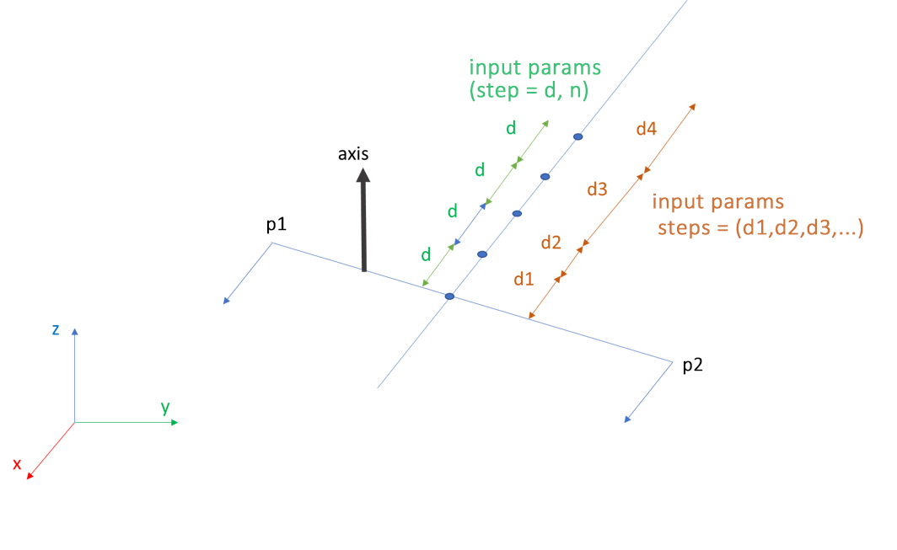

# Script Usage

## orthophoto.jl

Orthographic projection of 3D point cloud.

#### Input parameters description:
 - PO: projection plane and sight direction. Option: "XY+","XY-","XZ+","XZ-","YZ+","YZ-"
 - output: output filename for image
 - source: Potree projects
 - bbin: volume
 - GSD: ground sampling distance
 - bgcolor: background color of image
 - quote: quote of section
 - thickness: thickness of section
 - ucs: Path to UCS JSON file. If not provided is the identity matrix
 - epsg: EPSG code
 - pc: if true clip point cloud


#### Options:

```
$ julia orthophoto.jl -h   

positional arguments:
  source               A text file with Potree directories list or a
                       single Potree directory

optional arguments:
 -o, --output OUTPUT   Output image
 --bbin BBIN           Bounding box as 'x_min y_min z_min x_max y_max
                       z_max' or Potree JSON volume model
 --po PO               Projection plane: XY+, XY-, XZ+, XZ-, YZ+, YZ-
                       (default: "XY+")
 --gsd GSD             Resolution (type: Float64, default: 0.3)
 --quote QUOTE         Distance of plane from origin (type: Float64)
 --thickness THICKNESS
                       Section thickness (type: Float64)
 --pc                  If true a pc of extracted model is saved in a
                       LAS file
 --ucs UCS             Path to UCS JSON file. If not provided is the
                       Identity matrix
 --bgcolor BGCOLOR     Background color
 --epsg EPSG           EPSG code (type: Int64)
 -h, --help            show this help message and exit
```

#### Examples:

    # Orthographic projection of top view
    julia orthophoto.jl "C:/Potree_projects.txt" -o "C:/image.jpg" --bbin "0 0 0 1 1 1" --bgcolor "0 0 0"

    # Orthographic projection of left view and slice extraction
    julia orthophoto.jl "C:/Potree_projects.txt" -o "C:/image.jpg" --bbin "0 0 0 1 1 1" --po "YZ-" --quote 0.0 --thickness 1.0 --pc

    # Orthographic projection of horizontal section (UCS applied)
    julia orthophoto.jl "C:/Potree_projects.txt" -o "C:/image.jpg" --bbin "0 0 0 1 1 1" --po "XY+" --ucs "C:/ucs.json" --quote 0.0 --thickness 1.0


## section.jl

Produce a slice of 3D point cloud.

#### Input parameters description:
 - PO: projection plane and sight direction. Option: "XY+","XZ+","YZ+"
 - output: output filename for image
 - source: Potree projects
 - bbin: volume
 - quote: quote of section
 - thickness: thickness of section
 - ucs: Path to UCS JSON file. If not provided is the identity matrix
 - epsg: EPSG code

#### Options:

```
$ julia section.jl -h   

positional arguments:
  source               A text file with Potree directories list or a
                       single Potree directory

optional arguments:
 -o, --output OUTPUT   Output file
 --bbin BBIN           Bounding box as 'x_min y_min z_min x_max y_max
                       z_max' or Potree JSON volume model
 --po PO               Projection plane: XY+, XZ+, YZ+ (default:
                       "XY+")
 --quote QUOTE         Distance of plane from origin (type: Float64)
 --thickness THICKNESS
                       Section thickness (type: Float64)
 --ucs UCS             Path to UCS JSON file. If not provided is the
                       identity matrix
 --epsg EPSG           EPSG code (type: Int64)
 -h, --help            show this help message and exit
```

#### Examples:
    # extraction of horizontal section (UCS applied)
    julia section.jl "C:/Potree_projects.txt" -o "C:/slice.las" --bbin "0 0 0 1 1 1" --ucs "C:/ucs.json" --quote 0.0 --thickness 1.0

    # extraction of vertical section
    julia section.jl "C:/Potree_projects.txt" -o "C:/slice.las" --po "XZ+" --bbin "0 0 0 1 1 1" --epsg 32720 --quote 0.0 --thickness 1.0


# Future Work
## segment.jl

Point cloud segmentation: produce LAS file of Potree projects, setting projection (epsg code) in header if provided.

#### Input parameters description:
 - output: output LAS filename
 - source: Potree projects
 - epsg: projection code

Clipping volume are described by one of the following:
 - bbox: axis aligned bounding box
 - jsonfile: JSON format
 - c,e,r: position, scale, rotation

#### Options:

```
$ julia segment.jl -h   

positional arguments:
  source               A text file with Potree directories list or a
                       single Potree directory

optional arguments:
  -o, --output OUTPUT  Output file: LAS format
  --bbox BBOX          Bounding box as 'x_min y_min z_min x_max y_max
                       z_max'
  --jsonfile JSONFILE  Path to Potree JSON volume model
  --c C                Position: center of volume
  --e E                Scale: size of box
  --r R                Rotation: Euler angles (radians) of rotation of
                       box
  --epsg EPSG          EPSG code (type: Int64)
  -h, --help           show this help message and exit
```

#### Examples:

    # axis aligned bounding box
    julia segment.jl "C:/Potree_projects.txt" -o "C:/partition.las" --bbox "0 0 0 1 1 1" --epsg 32720

    # JSON format
    julia segment.jl "C:/Potree_projects.txt" -o "C:/partition.las" --jsonfile "C:/volume.json"

    # position, scale, rotation
    julia segment.jl "C:/Potree_projects.txt" -o "C:/partition.las" --c "0. 0. 0." --e "1. 1. 1." --r "1.5707963267948966 0. 0."


## slicing.jl

Point cloud slicing.

Return a set of slices, one LAS file per slice.

#### Input parameters description:
- output: output folder
- projectname: name of projects
- source: Potree projects
- bbin: region of interest

First slice is described with these parameters:
 - p1: start point
 - p2: end point
 - axis: a versor of plane
 - thickness: thickness of slice

Step between slices can be constant:
 - step: distance between slices
 - n: number of slices
or variable:
 - steps: distances between slices

If not provided returns only first slice.



#### Options:

```
$ julia slicing.jl -h   

positional arguments:
  source                A text file with Potree directories list or a
                        single Potree directory

optional arguments:
  -p, --projectname PROJECTNAME
                        Project name
  -o, --output OUTPUT   Output folder
  --bbin BBIN           Bounding box as 'x_min y_min z_min x_max y_max
                        z_max' or Potree JSON volume model
  --p1 P1               Start point
  --p2 P2               End point
  --axis AXIS           A vector in plane (default: "0 0 1")
  --thickness THICKNESS
                        Section thickness (type: Float64, default:
                        0.1)
  --step STEP           Constant distance between sections (type: Float64)
  --n N                 Number of sections (type: Int64)
  --steps STEPS         Distance between sections
  -h, --help            show this help message and exit
```

#### Examples:

    # One slice
    julia slicing.jl "C:/Potree_projects.txt" -o "C:/folder" -p "My_Proj" --bbin "0 0 0 1 1 1" --p1 "0 0 0" --p2 "1 1 1" --axis "0 0 1" --thickness 0.2

    # Costant distance between slice
    julia slicing.jl "C:/Potree_projects.txt" -o "C:/folder" -p "My_Proj" --bbin "0 0 0 1 1 1" --p1 "0 0 0" --p2 "1 1 1" --axis "0 0 1" --thickness 0.2 --step 1 --n 10

    # Variable distance between slice
    julia slicing.jl "C:/Potree_projects.txt" -o "C:/folder" -p "My_Proj" --bbin "0 0 0 1 1 1" --p1 "0 0 0" --p2 "1 1 1" --axis "0 0 1" --thickness 0.2 --steps "1 1 2 3 1 1 5 6"
